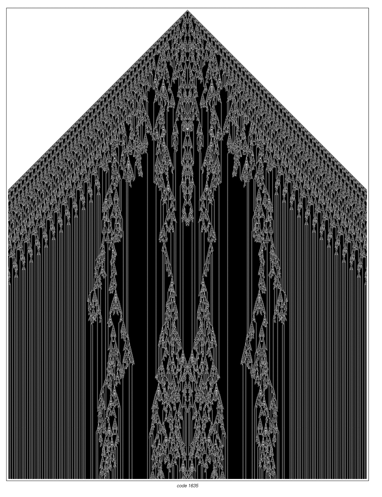

# code-1635
## Find the long-term behavior of code 1635.

What happens if one extends the picture above? Does the center region eventually become repetitive? Or does
it take over the whole pattern? How sensitive are the results to the details of the initial conditions used?

From ["A New Kind of Science: Open Problems and Projects"](https://www.wolframscience.com/openproblems/NKSOpenProblems.pdf)
by Stephen Wolfram.
